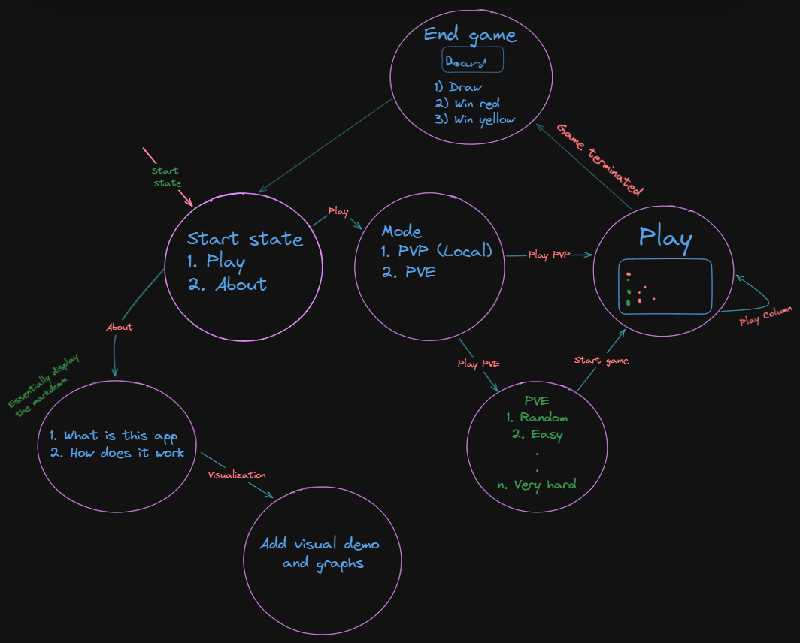

# Connect4Neat

The following app is a machine learning neural agent that aims to solve the game
of connect 4 using the NEAT algorithm and MCTS like the AlphaZero agent that was developed by google for the game of chess.

## Theory

Contains two neural networks:

1. Value neural network
2. Policy neural network

For more information of how they work and how they are meant to interact
have a look at the reference <https://joshvarty.github.io/AlphaZero/>

## Description

How is it structured

1. Game mode
   * Needs to include as visual modes
     * CLI
     * GUI
   * Gameplay modes
     * PVP
     * PVE
       * Contains a random agent as easy bot
       * Different modes of depth plus some random play for difficulty. Use Bernoulli distribution and the level of randomness
   * Game flow

2. Train mode
   1. 

## References

* <https://joshvarty.github.io/AlphaZero/>
